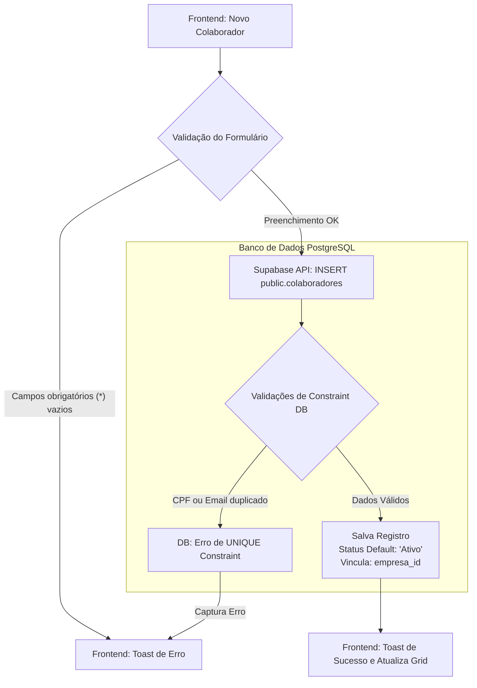
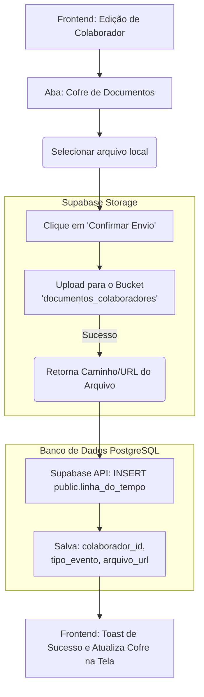
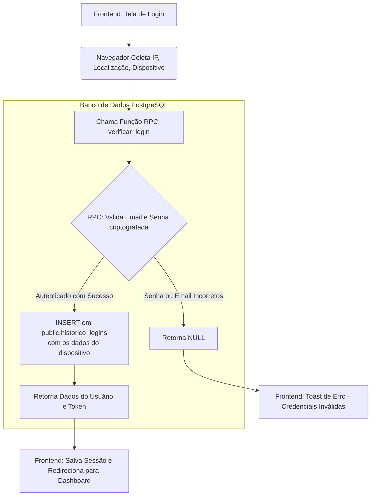

# 📖 Documentação do Sistema 

## 🏗️ Como o Sistema foi Projetado
O sistema foi projetado sob uma arquitetura moderna baseada em **BaaS (Backend as a Service)** utilizando o **Supabase** (PostgreSQL). A lógica de negócio é dividida entre o Frontend (que envia os payloads e consome os dados) e o Banco de Dados, que aplica regras rigorosas de segurança através de *Row Level Security* (RLS), *Triggers* automatizados e *Functions* (RPCs). 

Essa estrutura garante que mesmo que o frontend seja comprometido, o banco de dados valida perfis, aplica restrições de acesso e audita o histórico automaticamente.

---

## 🗄️ Dicionário de Dados: Onde vai cada dado?

Abaixo está o mapeamento de onde cada informação surge no frontend e como é armazenada no backend.

### 1. Autenticação e Perfis (`auth.users` e `public.perfis`)
* **De onde surge:** Da tela de Cadastro/Login do frontend.
* **Fluxo:** Quando o Supabase Auth registra o usuário na tabela de sistema `auth.users`, o banco de dados intercepta essa ação (via Trigger) e espelha os dados para a tabela `public.perfis`.
* **Campos Principais:**
  * `id`: UUID único do usuário.
  * `role`: Define o nível de permissão. Valores aceitos: `'adimim'`, `'rh'`, `'user'`. O sistema força o valor inicial como `'user'`.
```mermaid
flowchart TD
    A[Frontend: Tela de Cadastro] --> B(Preenche Formulário)
    B --> C{Validação Front}
    
    C -- "Falta campo" --> D[Frontend: Toast de Erro]
    E --> [Valida a localização, IP, navegador do usuario, para verificar se esta batendo o rash do supabase] --> F[Supabase Auth: auth.signUp]
    
    subgraph Banco de Dados PostgreSQL
        G --> G[Inserção em auth.users]
        H -- "Dispara Trigger Automática" --> G{"handle_new_user()"}
        I --> J[INSERT em public.perfis\nrole default: 'user']
    end
    
    H --> I[Frontend: Toast de Sucesso]
```
### 2. Cadastro de Colaboradores (`public.colaboradores`)
* **De onde surge:** Formulário principal de cadastro ou edição de funcionários no frontend.
* **Fluxo:** O frontend envia um payload (JSON) direto para esta tabela via API do Supabase.
* **Campos Principais:**
  * `nome_completo`, `cpf` (Campo único/Unique), `data_nascimento`.
  * `email` (Campo único/Unique), `telefone`, `endereco`.
  * `cargo`, `departamento`, `salario` (Tipo numérico 10,2).
  * `status`: Controlado pelo ENUM `status_colaborador` (Aceita apenas `'Ativo'` ou `'Desligado'`).
  * `empresa_id`: Chave estrangeira que define a qual empresa (tenant) o colaborador pertence.

### 3. Linha do Tempo e Ocorrências (`public.linha_do_tempo`)
* **De onde surge:** Ações do RH na tela do perfil do colaborador (ex: anexar um atestado, registrar uma promoção, férias ou aviso prévio).
* **Fluxo:** Ao salvar a ação, o frontend grava o registro apontando para o ID do colaborador afetado.
* **Campos Principais:**
  * `tipo_evento` e `descricao`: O que aconteceu no evento histórico.
  * `arquivo_url`: Caso o evento tenha um documento (como um PDF de atestado), este campo guarda o caminho de onde o arquivo está salvo no *Cofre* (Supabase Storage).

### 4. Controle de Aprovações (`public.solicitacoes`)
* **De onde surge:** Quando um usuário comum (sem permissão de 'adimim' ou 'rh') tenta alterar dados de um colaborador.
* **Fluxo:** Em vez de atualizar a tabela `colaboradores` diretamente, o frontend envia os dados para a tabela `solicitacoes`.
* **Campos Principais:**
  * `dados_novos`: Salva um objeto `JSONB` com as modificações propostas.
  * `status`: Inicia como `'Pendente'`. Administradores leem esta tabela para aprovar ou rejeitar.
flowchart TD
    A[Frontend: Usuário Comum Edita Dados] --> B[Gera Payload das Mudanças]
    B --> C[Supabase API: INSERT public.solicitacoes]
    
    subgraph Banco de Dados PostgreSQL
        C --> D[Salva registro com\nstatus = 'Pendente' e payload JSONB]
    end
    
    D --> E[Frontend: Admin acessa Painel de Aprovações]
    E --> F{Revisão do Admin}
    
    F -- Rejeita --> G[UPDATE solicitacoes\nstatus = 'Rejeitado']
    F -- Aprova --> H[UPDATE public.colaboradores\ncom extração do JSONB]
    H --> I[UPDATE solicitacoes\nstatus = 'Aprovada']
### 5. Auditoria de Acesso
* **De onde surge:** No momento exato do login no frontend, capturando informações do navegador/dispositivo.
* **Fluxo:** Ao invés do frontend apenas logar, ele chama uma *Function* no banco que escreve nesta tabela antes de devolver o token.
* **Campos Principais:** `ip`, `localizacao`, `dispositivo`, `data_login`.


---

## ⚙️ Funções do Sistema (Database Functions / RPC)

O sistema centraliza lógica crítica no backend por meio de funções PL/pgSQL para evitar falhas de segurança no client-side:

### 🛠️ `handle_new_user()`
* **Como funciona:** É uma função engatilhada (*Trigger*) chamada `on_auth_user_created`. 
* **O que ela faz:** Impede que contas fiquem sem perfil. Assim que o registro é feito no `auth.users`, ela roda o comando: `insert into public.perfis (id, email, role) values (new.id, new.email, 'user');`.

### 🛠️ `verificar_login(p_email, p_senha, p_ip, p_localizacao, p_dispositivo)`
* **Como funciona:** Função exposta como RPC (Remote Procedure Call) para o frontend.
* **O que ela faz:** Recebe o e-mail, senha e os dados do dispositivo do usuário. Verifica a senha e, se o login for válido, grava automaticamente os metadados do navegador na tabela `historico_logins` e devolve um JSON com o `role` do usuário. Isso garante rastreabilidade total (Auditoria) sem depender de múltiplas requisições do frontend.

### 🛠️ `rls_auto_enable()`
* **Como funciona:** Um *Event Trigger* acionado no nível de DDL (`CREATE TABLE`).
* **O que ela faz:** Se qualquer desenvolvedor criar uma tabela nova no schema `public`, esta função ativa o *Row Level Security (RLS)* automaticamente. Isso impede que dados fiquem acidentalmente expostos ao público caso alguém esqueça de travar a tabela nova.